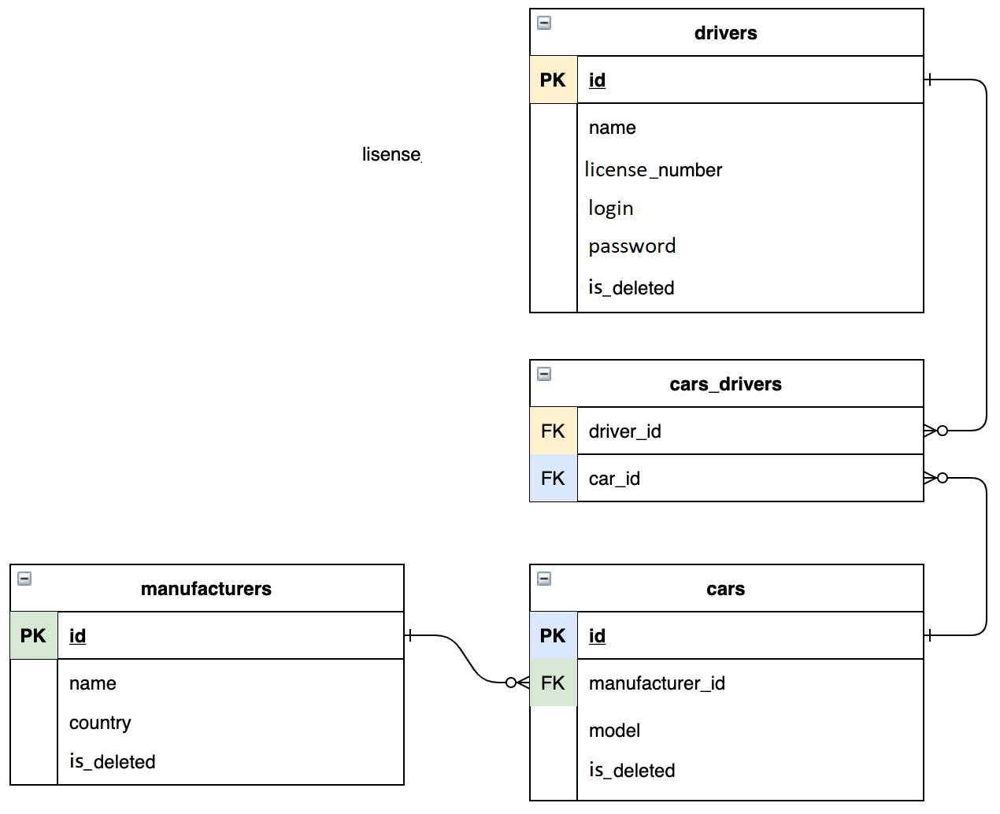
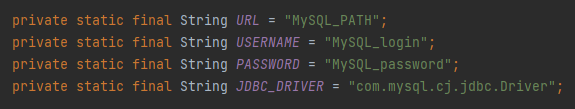
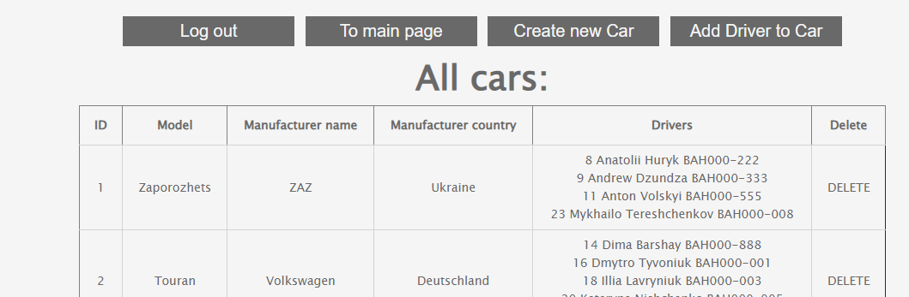
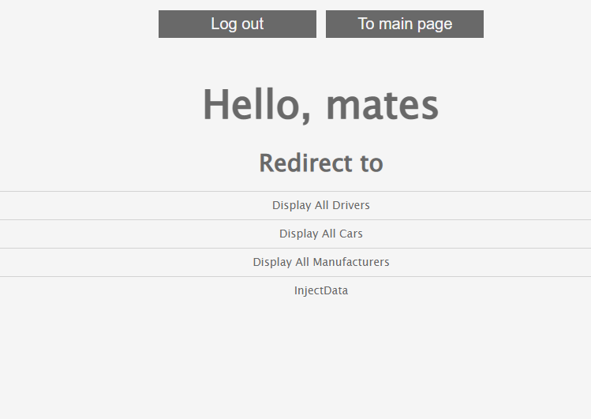

### This web app designed to simulate simple taxi service app.
#### Using this app you can:
* track all available cars and working drivers
* register new drivers
* add new cars and their manufacturers
* delete cars, drivers and manufacturers
* add drivers to cars
* track your cars as a driver

### Implementation details
Project based on famous 3-layered architecture:
1. Data access layer (DAO)
1. Application layer (service)
1. Presentation layer (controllers)

### Technologies:
* Apache Tomcat (v9.0.55)
* MySQL (v8.0.25)
* JDBC
* Servlet
* JSP
* JSTL
* HTML, CSS
* Maven
* Maven Checkstyle Plugin

### The next DB diagram shows relations between Car, Driver, and Manufacturer.

## Run Project
Tools to run this project
- IntelliJ IDEA Ultimate [IDEA](https://www.jetbrains.com/idea/download/#section=mac)
- ApacheTomcat [TOMCAT](https://tomcat.apache.org/download-90.cgi)
- MySQL and MySQL Workbench [MySQL](https://www.mysql.com/downloads/)

- Clone the project on your IDE
- In MySQL Workbench run the script from resources/init_db.sql.
  #### Warning!!! if you already have a database named "taxi", this script will delete it and create a new database with the same name.

- In src/main/java/taxi/util/ConnectionUtil change URL, USERNAME and PASSWORD with your data

###### For example

jdbc.Driver is already provided, but you can change it with more suitable as well

- Configure TomCat Local server
  * (Add New Configuration -> TomCat -> Local -> Fix -> taxi-service:war exploded -> OK)
- Enjoy the project!

(If your logger doesn't write logs in file, create file `app.log` in `src/logs` folder.
Then in `src/main/resources/log4j2.xml` change the line `<File name = "File" fileName = "logs\app.log">`
where you should replace `logs\app.log` with your absolute path to `app.log` file)
## Login page

## Cars page

## Menu page
