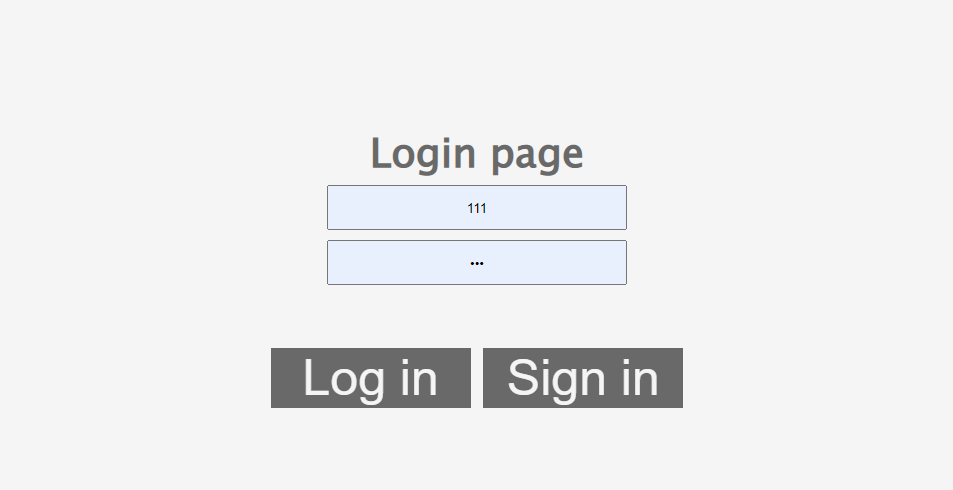
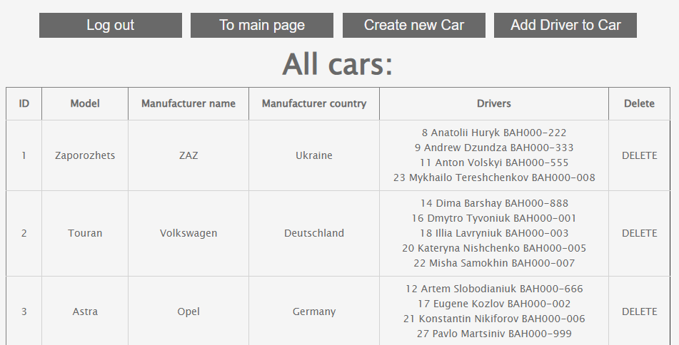
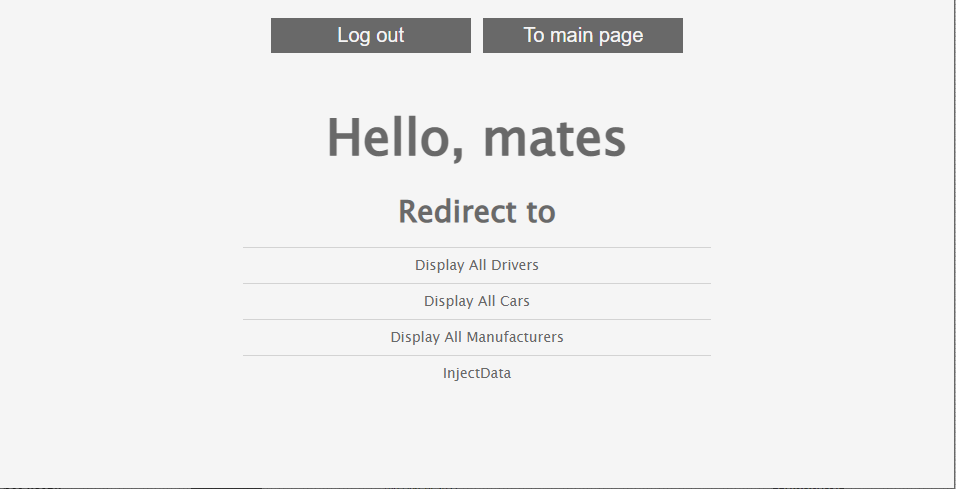

### This web app designed to simulate simple taxi service app.
#### Using this app you can:
* track all available cars and working drivers
* register new drivers
* add new cars and their manufacturers
* delete cars, drivers and manufacturers
* add drivers to cars

### Implementation details
Project based on famous 3-layered architecture:
1. Data access layer (DAO)
1. Application layer (service)
1. Presentation layer (controllers)

### Technologies:
* Apache Tomcat (v9.0.55)
* HTML, CSS
* Java 11
* JDBC
* JSP
* JSTL
* Maven
* Maven Checkstyle Plugin
* MySQL (v8.0.25)
* Servlet

## Run Project
Tools to run this project
- [x] IntelliJ IDEA Ultimate [IDEA](https://www.jetbrains.com/idea/download/#section=mac)
- [x] ApacheTomcat [Tomcat](https://tomcat.apache.org/download-90.cgi)
- [x] MySQL and MySQL Workbench [MySQL](https://www.mysql.com/downloads/)
- [x] Clone the project on your IDE
- [x] In MySQL Workbench run the script from resources/init_db.sql.
  #### Warning!!! if you already have a database named "taxi", this script will delete it and create a new database with the same name.

- [x] In src/main/java/taxi/util/ConnectionUtil change URL, USERNAME and PASSWORD with your data
- [x] Configure TomCat Local server
  * (Add New Configuration -> TomCat -> Local -> Fix -> taxi-service:war exploded -> OK)

## Login page

## Cars page

## Menu page

